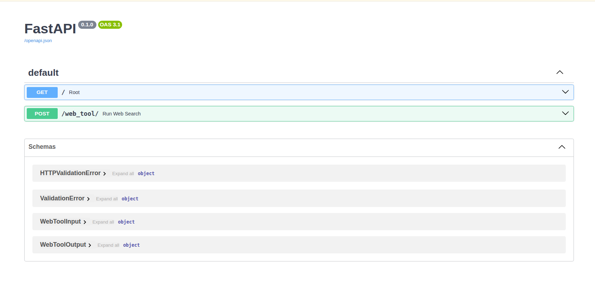

## 🚀 Quick Start

Get your BioChirp Web Agent up and running in minutes.

Step 1: Change Directory

### Step 1: Change directory

```bash
cd ~/bioc/app/tools/web_agent
```

### Step 2: Start the Service (Choose One Option)

* A. Foreground mode (runs in your terminal; logs visible; stops when you hit Ctrl+C):

```bash
docker compose up --build
```

* B. Detached mode (runs in background; use docker compose logs / docker compose down to manage):

```bash
docker compose up --build -d
```

### Step 3: Access the Web Agent

The service will be available at: [Link](http://192.168.22.20:8015)


### Step 4: Stop & Remove Containers

```bash
docker compose down
```

### API Documentation
For interactive API docs and testing, visit:[Link](http://192.168.22.20:8015/docs)


